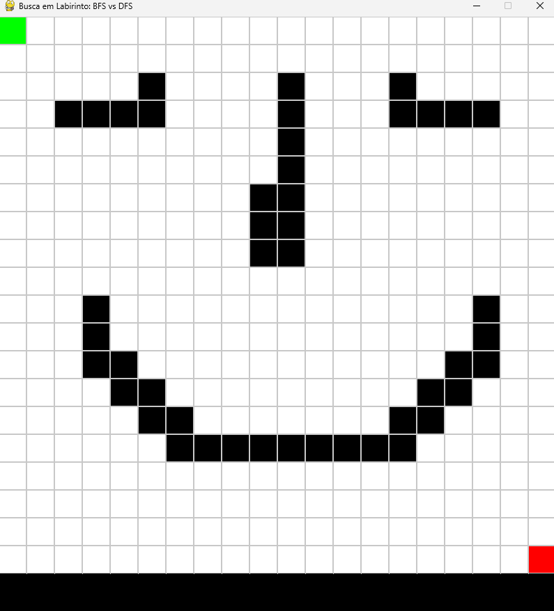
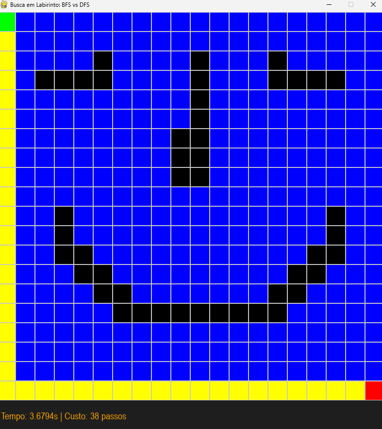
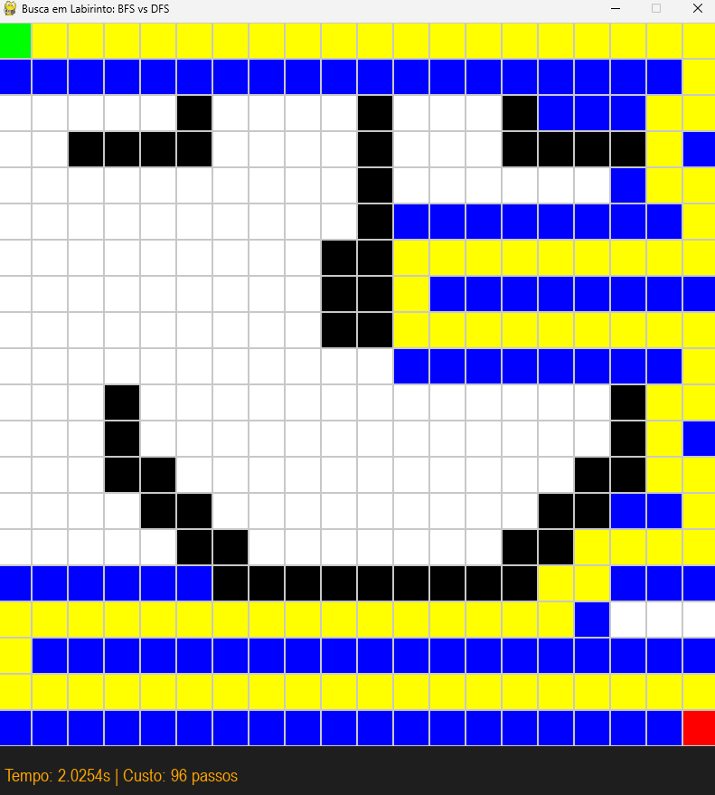
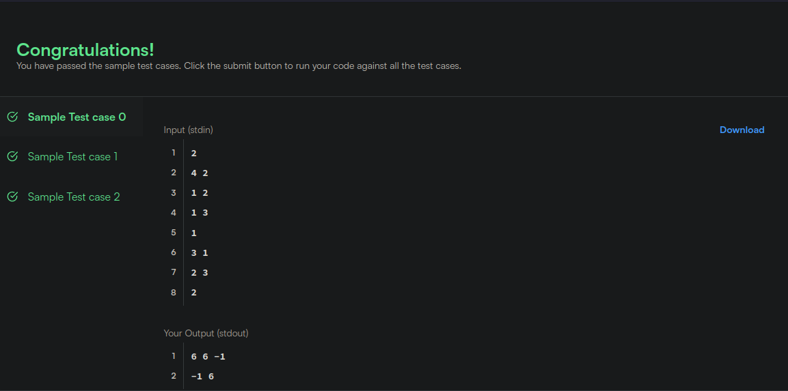
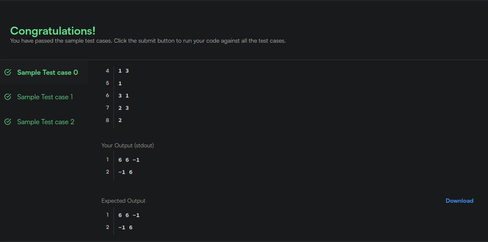
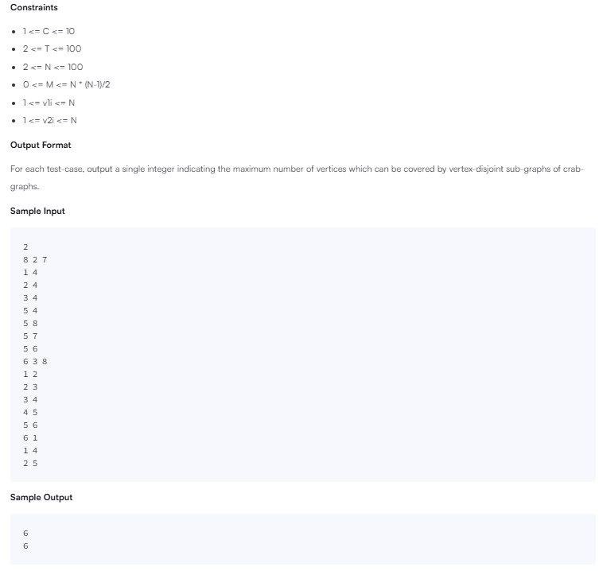
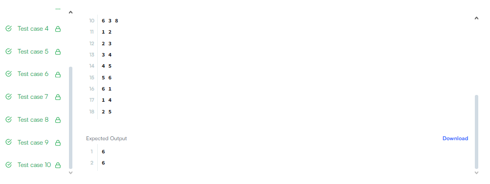

# GRAFOS 01 - HACKERRANK PROBLEM AND LABYRINTH GAME

**Conteúdo da Disciplina**: Grafos 01

## Sobre

Este projeto consiste na resolução de questões da plataforma HackerRank variando nas dificuldades de médio e difícil. O objetivo é utilizar o conteúdo estudado.

Fizemos também um game com a proposta de solução de um labirinto utilizando DFS e BFS.

## Questões

<center>

</head>
<body>

<table>
    <thead>
        <tr>
            <th>Questão</th>
            <th>Nível</th>
        </tr>
    </thead>
    <tbody>
        <tr>
            <td><a href="https://www.hackerrank.com/challenges/crab-graphs/problem?isFullScreen=true" target="_blank">BFS: Crab Graphs</td>
            <td>Médio</td>
        </tr>
        <tr>
            <td><a href="https://www.hackerrank.com/challenges/ctci-bfs-shortest-reach/problem" target="_blank">BFS: Shortest Reach in a Graph</td>
            <td>Difícil</td>
        </tr>
    </tbody>
</table>

</body>
</html>

</center>

## Contribuidores

<center>

</head>
<body>

<table>
    <thead>
        <tr>
            <th>Matrícula</th>
            <th>Nome</th>
            <th>GitHub</th>
        </tr>
    </thead>
    <tbody>
        <tr>
            <td>202046102</td>
            <td>Felipe das Neves Freire</td>
            <td><a href="https://github.com/FelipeFreire-gf" target="_blank">Felipe</a></td>
        </tr>
        <tr>
            <td>222037700</td>
            <td>Leonardo de Melo Lima</td>
            <td><a href="https://github.com/leozinlima" target="_blank">Leonardo</a></td>
        </tr>
    </tbody>
</table>

</body>
</html>

</center>

## Linguagem Utilizada

- Python

## Uso

Entrar na plataforma [HackerRank](https://www.hackerrank.com/dashboard), procurar pelo nome/número do exercício, colar na aba code e clicar em _Run Code_

## Pré-requisitos para o GAME:
Para rodar o game, é necessário que essas dependências estejam instaladas na sua máquina: 
- Python 3.10.0 (ou superior)
- pygame

### Execute a seguinte linha de comando para executar o jogo:

```
python labirinto.py

```

## Tutorial do Game

Para jogar, é necessário primeiro desenhar o labirinto, para isso, basta clicar com o botão esquerdo do mouse e arrastar para desenhar os muros. Para apagar basta clicar com o botão direito do mouse.

- O algoritmo também pode ser iniciado sem ter desenhados os muros;

- Utilize a letra "b" para inicial o algoritmo BFS e a letra "d" para inicializar o algoritmo DFS;

- Utilize a leta "r" para reiniciar o jogo.

Nas telas será mostrado o caminho percorrido pelo algoritmo. Além do tempo de execução do algoritmo. E o número de passos percorridos. 

## Screenshots do Game

Na figura 1 apresentamos a tela inicial do game, onde é possível construir os muros do labirinto clicando com o botão esquerdo do mouse, se necessário pode-se apagar as parades clicando com o botão direito do mouse.

<div align="center">
  <font size="4"><p style="text-align: center; margin-bottom: 50px;"><b>Figura 1: Tela inicial de desenho dos muros</b></p></font>
</div>

<div align="center">

</div>
<div align="center">

</div>

Na figura 2 apresentamos a tela que ao clicar na letra B é iniciado o algoritmo BFS que percorrerá o labirinto marcando de azul os nós visitados, ao encontrar o nó "end", que é o nó representando a saída do labirinto, o algoritmo dará o menor caminho possível representado pela cor amarela.

<div align="center">
  <font size="4"><p style="text-align: center; margin-bottom: 50px;"><b>Figura 2: Tela BFS</b></p></font>
</div>

<div align="center">

</div>
<div align="center">

</div>

Na figura 3 apresentamos a tela que ao clicar na ledra D é iniciado o algoritmo DFS que percorrerá o labirinto marcando de azul os nós visitados, ao encontrar o nó "end", que é o nó representando a saída do labirinto, o algoritmo dará o caminho possível representado também pela cor amarela.

<div align="center">
  <font size="4"><p style="text-align: center; margin-bottom: 50px;"><b>Figura 3: Tela DFS</b></p></font>
</div>

<div align="center">

</div>
<div align="center">

</div>

## Screenshots do HackerRank

<div align="center">
  <font size="4"><p style="text-align: center; margin-bottom: 50px;"><b>Figura 4: Resultados questão difícil rackerRank</b></p></font>
</div>

<div align="center">

</div>
<div align="center">

<div align="center">
  <font size="4"><p style="text-align: center; margin-bottom: 50px;"><b>Figura 5: Resultados questão difícil rackerRank</b></p></font>
</div>

<div align="center">

</div>
<div align="center">

<div align="center">
  <font size="4"><p style="text-align: center; margin-bottom: 50px;"><b>Figura 6: Resultados questão média rackerRank</b></p></font>
</div>

<div align="center">

</div>
<div align="center">

<div align="center">
  <font size="4"><p style="text-align: center; margin-bottom: 50px;"><b>Figura 7: Resultados questão média rackerRank</b></p></font>
</div>

<div align="center">

</div>
<div align="center">


## Vídeo

Explicamos o funcionamento do jogo e do código de nível difécil do HackerRank, como estava difícil de encaixar a explicação da questão média preferimos focar na explicação dos problemas de maior dificuldade.

</head>
<body>

<table>
    <thead>
        <tr>
            <th>Vídeo 01</th>
        </tr>
    </thead>
    <tbody>
        <tr>
            <td><a href="https://www.youtube.com/watch?v=nXo-YzBztkY" target="_blank">HackerRank Problem + Labyrinth Game</a></td>
        </tr>
    </tbody>
</table>

</body>
</html>
